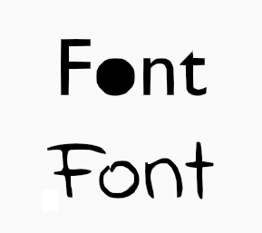

# Font comic

Usando la tipografía [Indie Flower](https://fonts.google.com/specimen/Indie+Flower) o cualquier otra, al  convertir el objeto Text a GPencil en Blender se rellena el espacio interior con un solo color y para evitarlo debemos hacer que la tipografía, por ejemplo en la letra `O` romper la forma de circulo. Esto se puede lograr usando  [FontForge](https://fontforge.org/en-US/) y rompiendo las letras que den ese problema.

[Descargar](./files/IndieFlower.ttf)

## Enlaces

* [Uso de texto en Blender](https://docs.blender.org/manual/en/latest/modeling/texts/introduction.html)
* [Vídeo: Convertir texto en Grease Pencil](https://www.youtube.com/watch?v=qE_hKCP2Ntk)
