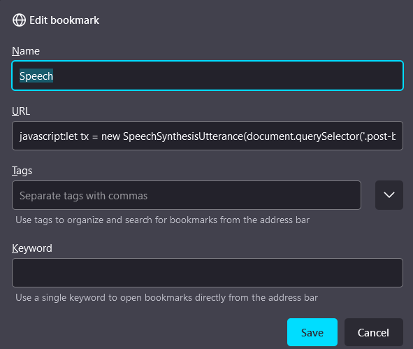

# Activar Speech del navegador desde un Bookmark

Navegadores como Firefox ofrecen la opción de lectura `about:reader`,
que de forma automática se activa, pero hay veces que es necesario
activar en webs sin soporte.

Por eso, podemos usar el objeto `SpeechSynthesisUtterance`, el cual
permite iniciar el `Speech` del navegador.



```js
javascript:let tx = new SpeechSynthesisUtterance(document.querySelector('body').innerText); tx.lang = speechSynthesis.getVoices()[1].lang; tx.voice = speechSynthesis.getVoices()[1]; tx.rate = 2; speechSynthesis.speak(tx);
```

* `querySelector('body')`: especificar la parte que se va leer.
* `rate = 2`: cambiar la velocidad de lectura.

> Para pausar la lectura `speechSynthesis.pause()` o cerrar la pestaña del navegador.

## Enlaces

* [SpeechSynthesisUtterance](https://developer.mozilla.org/en-US/docs/Web/API/SpeechSynthesisUtterance)
* [SpeechSynthesis](https://developer.mozilla.org/en-US/docs/Web/API/SpeechSynthesis)
