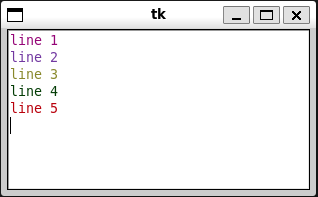

# Texto en Tkinder con varios colores

```python
import tkinter as tk
import random

class App(tk.Frame):
    def __init__(self, master):
        super().__init__(master)
        self.pack()

        self.tx = tk.Text()
        self.tx.bind('<Key>', self.key_press)
        self.tx.pack()

    def color(self):
        # Genera de forma aleatoria un color
        r = random.randrange(0, 255)
        g = random.randrange(0, 255)
        b = random.randrange(0, 255)
        return '#%02x%02x%02x' % (r, g, b)

    def key_press(self, event):
        if event.keycode == 36:
            # Cuando se usa la tecla <ENTER>
            # inicia la línea con otro color
            nlines = int(self.tx.index(tk.END).split('.')[0])

            for i in range(1, nlines):
                tag = '#%s' % i
                self.tx.tag_delete(tag)
                self.tx.tag_add(tag, '%s.0' % i, '%s.0' % (i + 1))
                self.tx.tag_config(tag, foreground=self.color())

root = tk.Tk()
myapp = App(root)
myapp.mainloop()
```



## Enlaces

* [Documentación de Tkinter](https://docs.python.org/3/library/tkinter.html)
* [Documentación de Random](https://docs.python.org/3/library/random.html)
